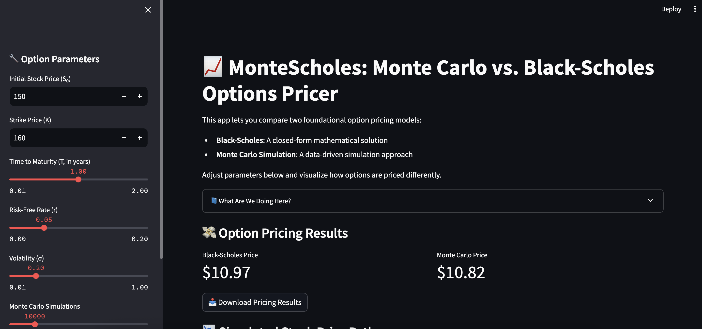

# 📈 OptionInsight: Monte Carlo vs Black-Scholes Option Pricer

An interactive Streamlit web app to simulate and compare two foundational option pricing models:
- **Black-Scholes Formula**
- **Monte Carlo Simulation**



## 🔧 Features
- Adjustable parameters: S₀, K, σ, T, r
- Price call or put options
- Visualize GBM paths
- Learn how each model works with formulas and tooltips

## 🧠 Built With
- Python · Streamlit · NumPy · SciPy · Matplotlib

## 🚀 How to Run
```bash
pip install -r requirements.txt
streamlit run app.py
```

## 📚 Educational Value
This project helps you understand:
- Stochastic processes in finance
- Risk-neutral valuation
- Simulation vs closed-form pricing

## 📝 Project Structure
```
option-pricer-app/
├── app.py                      # Streamlit app
├── models/
│   ├── black_scholes.py        # Black-Scholes logic
│   ├── monte_carlo.py          # Monte Carlo simulation
│   └── simulate_paths.py       # GBM simulator
├── utils/
│   └── formulas.py             # Mathematical formulas in LaTeX or Markdown
├── requirements.txt
├── README.md
```

## 📎 License
MIT — use freely for learning and portfolios.
